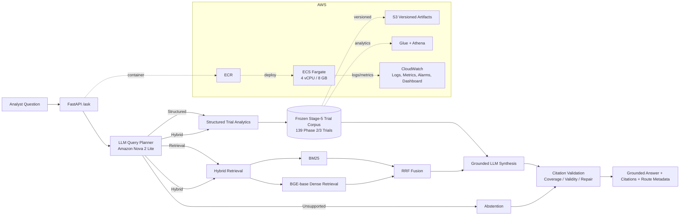

# Evidence-Grounded Obesity Drug Competitive Intelligence Copilot

A clinical intelligence system for comparing obesity-drug development pipelines and synthesizing clinical-trial evidence across **Novo Nordisk, Eli Lilly, Amgen, and Boehringer Ingelheim**.

The system combines:

- structured trial analytics for factual and comparative questions,
- hybrid retrieval over trial evidence using **BM25 + BGE-base + Reciprocal Rank Fusion**,
- an LLM query planner and grounded synthesis layer using **Amazon Bedrock / Nova 2 Lite**,
- citation validation and abstention guardrails,
- AWS deployment, monitoring, and analyst-facing Streamlit UI.

## Disclaimer

This project is provided solely for educational, research, and portfolio purposes. It is not intended to provide medical, clinical, investment, regulatory, legal, or commercial advice, and should not be used to make real-world healthcare or business decisions. All analyses are derived from publicly available data sources and may contain inaccuracies, omissions, delays, or changes in source information. References to companies, products, drug candidates, trademarks, or clinical programs are for identification and analytical purposes only and do not imply affiliation, endorsement, sponsorship, or authorization by any organization mentioned. No claim is made regarding the safety, efficacy, regulatory approval, commercial potential, or comparative superiority of any drug or company. The software and outputs are provided “as is,” without warranties of any kind, and users are responsible for independently verifying any information before relying on it.

---

## Why this project exists

Competitive-intelligence analysts often need to answer questions such as:

- How large is each company's active obesity pipeline?
- Which programs are in Phase 3?
- How do two programs differ in trial footprint or development maturity?
- What does the trial record say about a program's development strategy?
- When should the system refuse to answer because the source data does not support the claim?

A single retrieval pipeline is not enough for all of these. Counts, shares, medians, and portfolio comparisons should come from structured data; narrative questions need evidence retrieval; unsupported forecasting or market-share questions should trigger abstention.

That led to a hybrid analytical architecture rather than a "chat over documents" implementation.

---

## System architecture



---

## Data scope

Final development corpus:

- **139** direct-obesity Phase 2/3 trials
- **4** target companies
- normalized program ownership and intervention mentions
- structured trial attributes + evidence text for retrieval

Primary source: **ClinicalTrials.gov**

Representative program counts in the frozen corpus include:

| Program | Trials |
|---|---:|
| Semaglutide | 26 |
| Tirzepatide | 18 |
| Liraglutide | 12 |
| Zenagamtide | 12 |
| CagriSema | 11 |
| Retatrutide | 10 |
| Maridebart cafraglutide / MariTide | 8 |
| Orforglipron | 8 |

The system does not infer market share, FDA approval probability, or future commercial success from these data.

---

## Question routing

The planner assigns each question to one of four routes:

### 1. Structured
For questions whose answer is best computed from normalized trial data.

Examples:
- active trial count by company,
- Phase 3 program count,
- median enrollment,
- portfolio shares.

### 2. Retrieval
For narrative evidence questions requiring trial-text grounding.

Examples:
- development strategy,
- population focus,
- trial design evidence.

### 3. Hybrid
For questions that need both computed facts and retrieved evidence.

### 4. Abstain
For unsupported questions such as:
- 2030 market-share forecasts,
- future approval probability,
- unsupported efficacy-superiority claims.

---

## Retrieval system

Retrieval uses:

- **BM25**
- **BAAI/bge-base-en-v1.5** dense embeddings
- normalized embeddings
- query prefix for retrieval
- equal-weight **Reciprocal Rank Fusion**, `k = 60`

Frozen Stage-4 RRF evaluation on 19 retrieval/hybrid questions:

| Metric | Score |
|---|---:|
| Recall@5 | 0.265 |
| Recall@10 | 0.476 |
| Hit@5 | 0.789 |
| Hit@10 | 0.842 |
| MRR | 0.582 |

No reranker was added after this evaluation.

---

## LLM analytical system

Both planning and synthesis use **Amazon Nova 2 Lite through Amazon Bedrock**.

The planner emits a structured query plan. Runtime tools include:

- `query_trials`
- `get_trial`
- `summarize_trials`
- `search_trial_evidence`

The synthesis layer produces a grounded answer with citations and supports one repair attempt when the first output violates synthesis constraints.

Key semantic guardrails include:

- explicit company scope preservation,
- company/program ownership consistency,
- active-share denominator preservation,
- status and maturity rules,
- citation validation,
- abstention for unsupported questions.

---

## Frozen holdout evaluation

Final evaluation used a **fresh 12-question holdout** with no post-holdout tuning.

Route balance:
- 3 structured
- 3 retrieval
- 3 hybrid
- 3 abstain

### Automated metrics

| Metric | Result |
|---|---:|
| Pipeline success | 100% |
| Exact route accuracy | 100% |
| Abstention accuracy | 100% |
| Citation validity | 100% |
| Citation coverage | 100% |
| Synthesis repair rate | 8.3% |
| Median latency | 4.19 s |
| P95 latency | 8.52 s |

### Human review

| Metric | Pass rate |
|---|---:|
| Answer correctness | 66.7% |
| Groundedness | 83.3% |
| Completeness | 75.0% |
| Citation entailment | 83.3% |
| Route acceptability | 100% |

The system was **frozen after holdout evaluation**. Failures were documented instead of tuning on the holdout.


---

## Failure analysis

The most important holdout failure was a structured analytical error on a highest-median-enrollment comparison: the expected answer was Amgen (~771), while the system answered Novo.

Partial failures included:
- omitting explicit comparative trial counts,
- overstating what retrieved evidence directly supported,
- incomplete population comparison,
- insufficient support for a timing statement.

These failures are useful because they separate:
- retrieval quality,
- structured computation correctness,
- synthesis completeness,
- citation entailment.

The project intentionally reports these instead of presenting only aggregate success metrics.

---

## Production architecture

### Runtime
- FastAPI
- Docker
- ECR
- ECS Fargate
- 4 vCPU / 8 GB task
- service normally scaled to `desiredCount = 0`

### Structured analytics
- S3
- AWS Glue Data Catalog
- Athena

### Monitoring
- CloudWatch JSON logs
- 10 metric filters
- 5 alarms
- 1 dashboard
- 7-day log retention

---

## Why ECS Fargate instead of Lambda?

Lambda was tested first rather than rejected theoretically.

Observed constraints:
- BGE/PyTorch initialization produced long cold starts,
- the account had a Lambda memory ceiling of 3008 MB,
- `/ask` could not complete interactively under that constraint.

The serving architecture was therefore changed to ECS Fargate.

Fargate validation showed:
- `/health`: PASS
- FastAPI request path: PASS
- CloudWatch logging: PASS
- `/ask` reached Amazon Bedrock
- observed request latency: ~8.4–8.7 s before the Bedrock account error

---

## Analyst UI

The Streamlit application exposes two modes:

### Live analyst copilot
Calls the real FastAPI backend.

Displays:
- answer,
- planner route,
- citations,
- latency,
- abstention status,
- synthesis-repair status,
- citation validity and coverage,
- execution details.

### Frozen evaluation evidence
Displays saved evaluation artifacts when the Bedrock runtime is unavailable.

This mode does **not** simulate live model answers.

Run locally:

```powershell
.\ui\start_local_ui.ps1
```

Start the cloud backend for a demo:

```powershell
.\ui\start_cloud_demo.ps1
```

Stop cloud compute afterward:

```powershell
.\ui\stop_cloud_demo.ps1
```


---


## Reproducibility and versioning

Frozen V3 artifacts are versioned in S3, including:

- semantic trial parquet,
- retrieval chunks,
- dense embeddings,
- runtime Dockerfile,
- production pipeline,
- deployment requirements,
- final evaluation metrics,
- freeze metadata,
- deployment manifest,
- monitoring configuration,
- Streamlit UI artifacts.

The project keeps evaluation and deployment artifacts separate from runtime source so that holdout results remain traceable.

---

## Limitations

- ClinicalTrials.gov is not a complete commercial intelligence source.
- Cross-trial comparisons are not randomized head-to-head comparisons.
- The final holdout is intentionally small.
- Retrieval Recall@5 is modest despite strong Hit@5.
- Human-rated answer correctness was 66.7% on the frozen holdout.
- No reranker was added to the frozen retrieval system.
- The service is designed as a portfolio prototype, not a regulated medical system.

